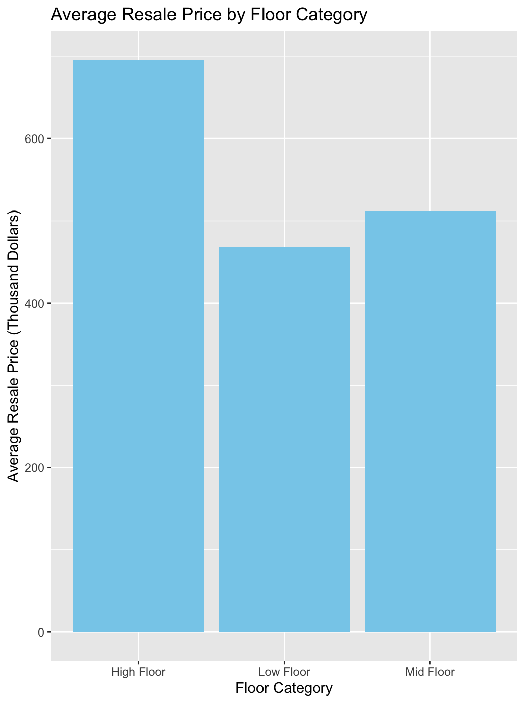

# HDB Resale Price Analysis in Singapore

  <!-- Use one of your visualization images -->

## Project Overview

This project analyzes factors influencing Housing and Development Board (HDB) resale prices in Singapore using 2021 data from data.gov.sg. The analysis compares three different predictive models: multiple linear regression, K-nearest neighbors (KNN), and decision trees.

## Key Findings

- Higher floor units command higher resale prices on average
- Flat type and floor area show strong positive correlation with resale price
- Multiple linear regression performed best among the tested models (MSE: 3173.5)
- Decision trees performed moderately (MSE: 4292.2)
- KNN performed the worst (MSE: 7251.3)

## Repository Structure
```
HDB-Resale-Price-Analysis/
│
├── data/                   
│   └── HDB_2021_sample.csv        
│
├── code/                   
│   └── final project.R
│
├── report/                 
│   └── Final_Project_Report.docx
│
├── images/                
│   ├── hdb-decision-tree.png
│   └── resale-price-by-floor.png
│
└── README.md             
```